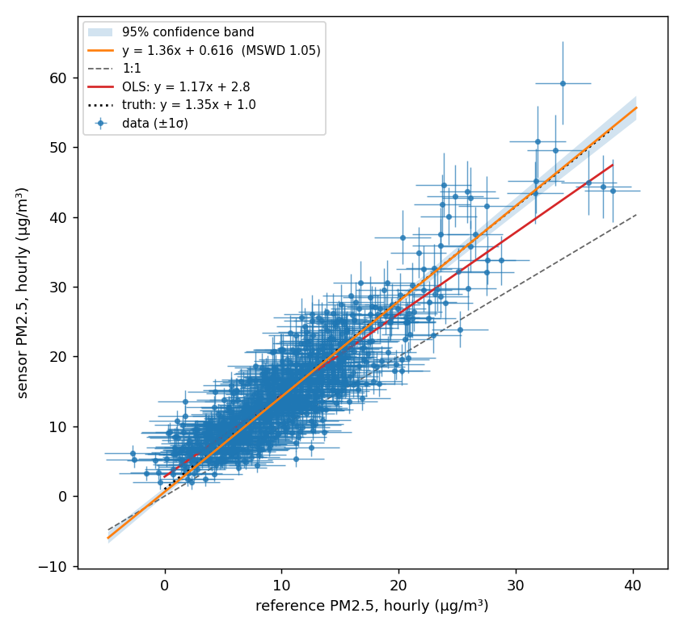

# Sensor versus reference: York or OLS?

The case this library exists for: a low-cost air sensor sits next to a
regulatory monitor for a month, and you want to know how the sensor
responds relative to the reference. Is the slope 1? Is there an offset? Is
the scatter what the two instruments' precisions predict?

The reflex is ordinary least squares of sensor on reference. This page
shows, with a simulation where the truth is known, why that gives the wrong
slope whenever the reference has appreciable noise, and when OLS is still
the right choice.

The full script is [`examples/sensor_vs_reference.py`](https://github.com/quant-aq/york/blob/main/examples/sensor_vs_reference.py).
Everything below comes from running it.

## The setup

A month of hourly data, simulated so the true relationship is known:

| Quantity | Value | Basis |
|---|---|---|
| True PM2.5 | median 9 µg/m³, SD about 6, hour-to-hour autocorrelation 0.9 | typical US urban hourly series |
| Reference monitor noise | 2.4 µg/m³ hourly, one sigma | BAM-1020 hourly detection limit of 4.8 µg/m³ at two sigma; verify against the current datasheet |
| Sensor response | sensor = 1.0 + 1.35 × true | uncorrected optical sensors commonly over-read relative to FEM monitors (Barkjohn et al., 2021) |
| Sensor precision | ±(1.0 µg/m³ + 10% of reading) | `InstrumentSpec(absolute=1.0, relative=0.10)` |

Three fits of sensor against reference:

```python
import york
from york.errors import InstrumentSpec

ols_slope, ols_intercept = np.polyfit(reference, sensor, 1)

result = york.fit(
    reference, sensor,
    sx=2.4,                                       # BAM hourly, one sigma
    sy=InstrumentSpec(absolute=1.0, relative=0.10),
)
```

## What comes out



Hourly data, n = 720:

| Method | Slope | Intercept |
|---|---|---|
| Truth | 1.350 | 1.00 |
| OLS, sensor on reference | 1.166 | 2.79 |
| OLS, reference on sensor, inverted | 1.492 | −0.60 |
| **York** | **1.365 ± 0.028** | **0.62** |

York's MSWD is 1.05: the scatter is consistent with the stated precisions.
Its test of slope = 1 gives p below 1e-30, as it should for a sensor
reading 35 percent high.

OLS is 14 percent low on the slope and compensates with an intercept almost
three times too large. Regressing the other way round and inverting is 10
percent high. The two OLS lines bracket the truth, and neither is it.

## Why OLS gets the slope wrong

OLS assumes x is known exactly. When x carries random error with variance
`σx²`, the fitted slope is attenuated by the *reliability ratio*

```
λ = var(true x) / (var(true x) + σx²)
```

so `slope_OLS ≈ λ × slope_true`. This is regression dilution, known since
the 1870s and worked out in full by Fuller (1987); Frost and Thompson (2000)
and Hutcheon et al. (2010) are readable treatments. It is a bias, not
noise: more data makes the estimate more precisely wrong.

Here `var(true)` is 32 (µg/m³)² and the hourly BAM noise variance is 5.8,
giving λ = 0.85 and a predicted OLS slope of 1.15. The fit gave 1.17, the
difference being sampling noise. The intercept is pulled up to keep the
line through the centroid.

The clinical chemistry literature reached this conclusion decades ago for
exactly this problem, comparing one assay against another when both are
imprecise (Cornbleet and Gochman, 1979; Linnet, 1993). Deming regression
(Deming, 1943) is their standard remedy; York's method is the general
weighted case of it, and Cantrell (2008) reviews the same family of fits
for atmospheric chemistry.

## The same month as daily means

Averaging 24 hours divides both instruments' random precision by
`sqrt(24)`. The reference noise drops to 0.5 µg/m³, the reliability ratio
rises to 0.98, and the two methods converge:

| Method | Slope | Intercept |
|---|---|---|
| Truth | 1.350 | 1.00 |
| OLS, sensor on reference | 1.331 | 1.07 |
| OLS, reference on sensor, inverted | 1.348 | 0.90 |
| **York** | **1.341 ± 0.035** | **0.96** |

Two things to take from this:

- **Averaging shrinks precision, not bias.** The sensor still reads 35
  percent high. York's answer barely moves between hourly and daily; OLS
  moves because its bias shrank.
- **Sigmas must match the averaging interval.** The script scales both
  instruments' precision by `sqrt(24)` for the daily fit. Feeding hourly
  sigmas to daily means gave an MSWD of 0.11 on the first run, the library's
  way of saying the stated uncertainties were far too large. York cannot
  save you from a wrong error model, but MSWD will tell you it is wrong.

## What EPA guidance says, and whether it is right

!!! note "EPA recommends OLS. For its purpose, that is defensible."

    The US EPA's *Air Sensor Guidebook* (Williams et al., 2014), its
    successor the *Enhanced Air Sensor Guidebook* (US EPA, 2022), and the
    performance-targets reports for non-regulatory supplemental and
    informational monitoring (NSIM) of PM2.5 and ozone sensors (Duvall et
    al., 2021a, 2021b) all evaluate a sensor by ordinary least squares of
    sensor against a co-located FRM or FEM monitor, reporting slope,
    intercept and R² against target ranges. For PM2.5 the base-testing
    targets are a slope of 1.0 ± 0.35, an intercept within ±5 µg/m³, and
    R² ≥ 0.70, computed on 24-hour averages.

    **Why that holds up for the protocol it was written for:**

    - **It uses daily averages against a FEM.** At 24-hour averaging a
      beta-attenuation monitor's noise is well under 1 µg/m³, while the
      spread of daily means across a 30-day test is usually several µg/m³.
      The reliability ratio is close to 1 and OLS attenuation is a few
      percent, far inside a ±0.35 slope tolerance. The daily-means table
      above is exactly this situation: OLS and York agree within their
      uncertainties.
    - **It is a screening test, not a characterisation.** The targets are
      deliberately loose pass/fail criteria for non-regulatory use. A few
      percent of bias in the statistic does not change the outcome.
    - **It needs no uncertainty model.** OLS is reproducible across labs
      and sensor types without anyone having to agree on sigmas, which
      matters for a standard protocol.
    - **The Guidebook also wants a correction to apply to future sensor
      data.** For that job OLS of reference on sensor is the right tool,
      because the attenuation is the shrinkage a predictor should have.

    **Where it stops holding up:**

    - **Hourly data.** Hourly BAM noise at typical US concentrations gives
      a reliability ratio of 0.8 to 0.9, so OLS understates the slope by
      10 to 20 percent and overstates the intercept, as the hourly table
      above shows. The NSIM targets are defined on daily averages; applying
      the same OLS habit to hourly co-location is where things go wrong.
    - **Low-concentration sites and quiet months.** The attenuation
      depends on the spread of concentrations during the test, not on the
      sensor. The same sensor gets a lower OLS slope at a clean site than
      at a polluted one. A York slope with a correct error model does not
      depend on where or when you tested.
    - **Two instruments of similar precision.** Sensor against sensor, or
      a mid-cost monitor against a FEM at low concentrations. OLS is then
      biased in both directions and the choice of axis changes the answer.
    - **Reading the OLS slope as the sensor's response.** The NSIM slope is
      a test statistic under a fixed protocol. It is not a property of the
      sensor, and reporting it as "the sensor reads 17 percent high" when
      York says 35 is the mistake this library exists to prevent.

    **Practical advice.** Compute both. Report OLS slope, intercept and R²
    where a protocol asks for them, on the averaging interval it
    specifies. Report the York slope and intercept with their
    uncertainties, the MSWD, and the slope = 1 test as the sensor's actual
    response. York does not compute R² by design; take it from the OLS fit.

## When to use which

**Use York when the question is "how does the sensor respond?"** The
slope and intercept as properties of the sensor, the test of slope = 1,
and the MSWD check that the two instruments' precisions explain the
scatter. This is the method-comparison question, and it needs a method that
treats both instruments as imperfect. The effect is large whenever the
reference noise is not small compared with the spread of concentrations
across the study: hourly beta-attenuation data at a clean site is the
canonical case, and comparing two low-cost sensors to each other is worse.

**Use OLS when the question is "what will the reference read, given this
sensor value?"** That is calibration for deployment, and the future sensor
readings you will apply it to carry the same noise as the ones you fit on.
OLS of reference on sensor is the best linear predictor for that job, and
its attenuation is exactly the shrinkage a predictor should have (Frost and
Thompson, 2000). Correcting it with York would over-correct.

**Use OLS when a protocol specifies it, and report York alongside.** The
EPA guidance above defines slope, intercept and R² by OLS. Report those
numbers for that purpose, on the averaging interval the protocol names.
Then report the York slope so nobody mistakes an attenuated OLS slope for
the sensor's response: in the hourly example above, OLS puts the sensor at
1.17, comfortably inside the target of 1.0 ± 0.35, while the sensor
actually reads 1.35.

**Either is fine when the reference is far more precise than the
spread of the data.** Daily FRM filters against a month of varied
concentrations have a reliability ratio near 1, and the methods agree
within their uncertainties. York still gives you MSWD and the hypothesis
tests, so there is little reason not to use it.

## A note on hourly data

The residuals in this simulation are white, because the noise was
generated that way. Real sensor residuals are not: they track humidity and
temperature, which are autocorrelated over hours. `fit` estimates the
effective sample size from the residuals and warns when it drops well below
n. When that fires, the uncertainties and p-values above are optimistic,
and the warning is the library telling you so rather than letting the
comparison be oversold.

## References

- Barkjohn, K. K., Gantt, B., Clements, A. L. (2021). Development and
  application of a United States-wide correction for PM2.5 data collected
  with the PurpleAir sensor. *Atmospheric Measurement Techniques* 14,
  4617–4637. doi:10.5194/amt-14-4617-2021
- Cantrell, C. A. (2008). Technical note: Review of methods for linear
  least-squares fitting of data and application to atmospheric chemistry
  problems. *Atmospheric Chemistry and Physics* 8, 5477–5487.
  doi:10.5194/acp-8-5477-2008
- Cornbleet, P. J., Gochman, N. (1979). Incorrect least-squares regression
  coefficients in method-comparison analysis. *Clinical Chemistry* 25(3),
  432–438.
- Deming, W. E. (1943). *Statistical Adjustment of Data*. Wiley.
- Duvall, R. M., Clements, A. L., Hagler, G., et al. (2021a). Performance
  Testing Protocols, Metrics, and Target Values for Fine Particulate Matter
  Air Sensors: Use in Ambient, Outdoor, Fixed Site, Non-Regulatory
  Supplemental and Informational Monitoring Applications. US EPA,
  EPA/600/R-20/280.
- Duvall, R. M., Clements, A. L., Hagler, G., et al. (2021b). Performance
  Testing Protocols, Metrics, and Target Values for Ozone Air Sensors: Use
  in Ambient, Outdoor, Fixed Site, Non-Regulatory Supplemental and
  Informational Monitoring Applications. US EPA, EPA/600/R-20/279.
- Frost, C., Thompson, S. G. (2000). Correcting for regression dilution
  bias: comparison of methods for a single predictor variable. *Journal of
  the Royal Statistical Society A* 163(2), 173–189.
- Fuller, W. A. (1987). *Measurement Error Models*. Wiley.
- Hutcheon, J. A., Chiolero, A., Hanley, J. A. (2010). Random measurement
  error and regression dilution bias. *BMJ* 340, c2289.
  doi:10.1136/bmj.c2289
- Linnet, K. (1993). Evaluation of regression procedures for methods
  comparison studies. *Clinical Chemistry* 39(3), 424–432.
- US EPA (2022). Enhanced Air Sensor Guidebook. EPA/600/R-22/213.
- Wehr, R., Saleska, S. R. (2017). The long-solved problem of the best-fit
  straight line: application to isotopic mixing lines. *Biogeosciences* 14,
  17–29. doi:10.5194/bg-14-17-2017
- Williams, R., Kilaru, V., Snyder, E., et al. (2014). Air Sensor
  Guidebook. US EPA, EPA/600/R-14/159.
- York, D., Evensen, N. M., Martínez, M. L., De Basabe Delgado, J. (2004).
  Unified equations for the slope, intercept, and standard errors of the
  best straight line. *American Journal of Physics* 72(3), 367–375.
  doi:10.1119/1.1632486
